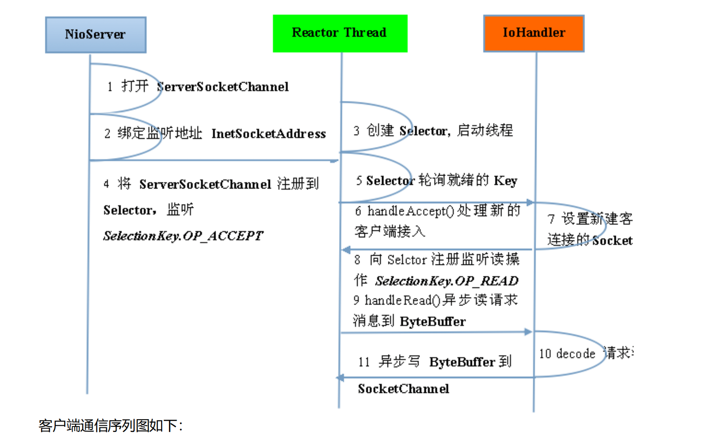
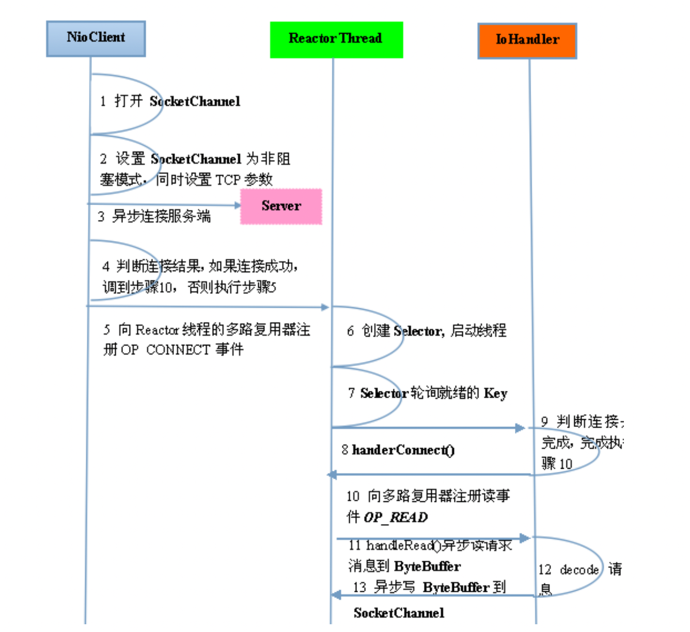

**Netty 架构按照 Reactor 模式设计和实现，它的服务端通信序列图如下：**

具体场景
问题：当服务端收到3个I/O请求时，在具体情况下的处理流程如下：
1. Reactor Thread（反应器线程）：
   1. 主线程（通常是Reactor Thread）会监听这3个I/O请求，而不会阻塞在单个请求上。
   2. 主线程会将这3个请求注册到相应的Selector上，并开始轮询Selector以检测是否有I/O事件发生。
2. I/O事件就绪：
   1. 当某个I/O请求就绪时，主线程的Selector会检测到该请求，并将其标记为就绪状态。
   2. 在具体情况下，假设第一个请求就绪，而其他两个尚未就绪。
3. IOHandler处理：
   1. 主线程会触发相应的IOHandler处理就绪的I/O请求。
   2. 在这种情况下，IOHandler会处理第一个就绪的请求，执行相应的操作，例如读取数据、写入数据等。
4. 业务线程池处理：
   1. 如果IOHandler判断第一个请求的业务逻辑较为复杂或耗时较长，它可以选择将任务转发到业务线程池中进行处理。
   2. 在这种情况下，业务线程池会创建一个线程来处理第一个请求的业务逻辑。
5. 其他I/O请求：
   1. 在主线程的轮询过程中，如果其他两个请求在此时就绪，主线程的Selector会检测到它们。
   2. 当其他两个请求就绪时，主线程会触发相应的IOHandler进行处理。
   3. 如果这些请求的业务逻辑简单，IOHandler可以直接在主线程中处理，而不需要创建新的线程。
**总结：** 
  在具体情况下，当服务端收到3个I/O请求时，主线程（Reactor Thread）会将这些请求注册到Selector上，并通过轮询Selector来检测是否有I/O事件就绪。就绪的事件会触发相应的IOHandler进行处理。对于复杂的或耗时的业务逻辑，IOHandler可以选择将任务转发到业务线程池中进行处理。每个请求可以在业务线程池中独立地进行处理，以保持I/O线程的高响应性能。其他请求可以在主线程中处理，而不需要创建新的线程。整个过程是异步的，利用了事件驱动和多线程机制来提高并发处理效率。

**由于 Netty 采用了异步通信模式，一个 IO 线程可以并发处理 N 个客户端连接和读写操作，这从根本上解决了传统同步阻塞 IO 一连接一线程模型，架构的性能、弹性伸缩能力和可靠性都得到了极大的提升。**

关于零拷贝：参考，io学习.md中整理的内容