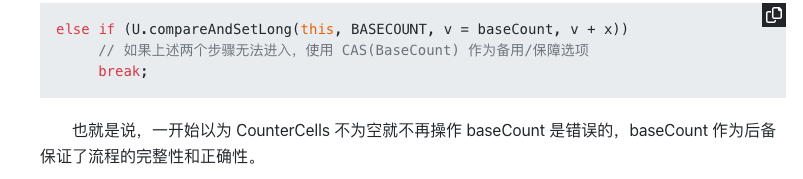

## concurrentHashmap - 1.8
### 并发

#### sizeCtl
关于 sizeCtl 变量：

-1 :代表table正在初始化,其他线程应该交出CPU时间片
-N: 表示正有N-1个线程执行扩容操作（高 16 位是 length 生成的标识符，低 16 位是扩容的线程数）
大于 0: 如果table已经初始化,代表table容量,默认为table大小的0.75,如果还未初始化,代表需要初始化的大小

### put
1. 如果为空数组则初始化数组**initTable()**
2. 找到第一个节点如果为空（数组当前位置是空）直接放入，否则通过CAS放入**casTabAt()**方法
3. 头节点f.hash == MOVED；头节点的hash 是 -1 并不是sizectl是-1，sizectl在扩容的时候可能-N，表示有n个正在协助扩容；（MOVED就是-1常量）表明是在迁移，扩容操作，关键方法**helpTransfer()**
4. 有头节点，并且不为空，首先加锁synchronized (f) 
   1. 如果头节点的：判断条件：头节点f.hash > 0 表明是链表
      1. equals相等覆盖否则尾插
   2. 否则是红黑树  （f instanceof TreeBin）
      1. 通过**putTreeVal()**进行红黑树插入
5. 插入完成以后，判断是否要转化为红黑树，如果数组长度小于64则进行扩容，否则如果>8进行链表转换为红黑树，通过关键方法**treeifyBin()**
   1. 数组小于64扩容操作 ：**tryPresize()**
   2. 遍历链表生成红黑树：锁住当前数组，生成红黑树，for循环插入

##### 初始化数组：initTable()
1. 关键字sizeCtl ：如果是-1则为扩容状态（只有一个线程在初始化，将其设置为-1，然后初始化）
2. 初始化数组：默认16，或者你设置值的2的次幂值
3. 设置sizeCtl == sc ，表为扩容的数：0.75倍，初始化完成后将sizeCtl设置为12

##### tryPresize()
1. 三步：
   1. 初始化（table == null ；initTable）
   2. 大于最大值2的31次放，1<<30
   3. transfer() 扩容操作
2. 对sizeCtl设置为一个很大负数
3. 主要执行transfer()方法，并将sizeCtl + 1
4. *所以，可能的操作就是执行 1 次 transfer(tab, null) + 多次 transfer(tab, nt)，这里怎么结束循环的需要看完 transfer 源码才清楚。*

##### transfer：思路是帮助扩容
1. 原数组长度为 n，所以我们有 n 个迁移任务，让每个线程每次负责一个小任务是最简单的，每做完一个任务再检测是否有其他没做完的任务，帮助迁移就可以了，而 Doug Lea 使用了一个 **stride**，简单理解就是步长，每个线程每次负责迁移其中的一部分，如每次迁移 16 个小任务。所以，我们就需要一个**全局的调度者**来安排哪个线程执行哪几个任务，这个就是属性 **transferIndex** 的作用
2. 第一个发起数据迁移的线程会将 transferIndex 指向原数组最后的位置，然后从后往前的 stride 个任务属于第一个线程，然后将 transferIndex 指向新的位置，再往前的 stride 个任务属于第二个线程，依此类推
3. i 处设置为这个 ForwardingNode，用来告诉其他线程该位置已经处理过了
4. 理解：
   1. 获取步长：就是上面说的stride：通过cpu计算，通过数组长度右移3位处以cpu，如果步长小于16默认16长度
   2. 扩容：若扩容数组为null则进行两倍扩容
   3. 切分步长：数组长度64，步长16，3个线程在扩容，从后往前，每16个划分给一个线程，如果第一个线程处理完了，数据还没迁移完成，将分配最新的0-15数组给第一个线程继续迁移
   4. 如果完成迁移设置sizectl：sizeCtl = (n << 1) - (n >>> 1); （牛逼：16*2 - 16/2（保证不为负数））
   5. synchronized 加锁锁住头节点
      1. fh >= 0（同样头节点的hash>0则为连表，：是不是和put一样的）
         1. ph & n（很巧妙，我们put的时候用的是n-1：16是10000， 我们&操作做的是与1111 & 运算， 这里我们是与10000 也就是高一位做&运算，将其分为两个高低链表）
         2.  setTabAt(nextTab, i, ln); setTabAt(nextTab, i + n, hn);将两个链表放到新的数组中
         3.  以fwd占位符代替旧的表 表示该桶已经处理过（该桶该位置已经处理过了）
      2.  条件（f instanceof TreeBin）同样如果是红黑树则分为两条树
          1.  如果小于6则转换为连表
          2.  否则创建红黑树进行节点插入

##### 为什么是2的次幂
1. 方便hash
   1. 当数组长度16: 1100 取余15 与 & 15是等价关系，速度快
2. 方便扩容
   1. 当进行两倍扩容，只需要判断该链表上的node，高一位与1&操作即可拆分出两条链表
3. hash的散列函数
   1. static final int spread(int h) {
    return (h ^ (h >>> 16)) & HASH_BITS;
    }
    ^异或操作，相同为0，不同为1 先将高16位与低16位进行操作，尽量让低16位打散
    HASH_BITS 为2的31次方-1，0111111111...... 取&操作，为了使最高位为0，不为负数，若为1则为负数

### addcount()
1. 在无并发的情况下，使用单一的属性 baseCount 进行累计（CAS），一旦操作不成功，进入并发场景。
2. 
3. addCount(long x, int check) 
   1. 两个参数一个要增加的值
   2. 一个是是否需要扩容的校验：list传入的是连表长度/ tree传入的是固定值2，/remove传入的是-1
流程：
   1. CounterCells 是否为空 > CAS(baseCount) > CAS(CounterCells[n]) > **fulllAddCount()**
   2. addCount 有一种思想，即当一个集合发生过并发时，其后续发生的并发可能性也越高，所以会先判断 CounterCells 是否为空，如果不为空，则后续不再考虑在baseCount上操作
   3. 并发添加完数据后会检查check参数，判断是否扩容，主要是 >? sizeCtrl

#### fulllAddCount
1. 负责的功能 ： 初始化， 更新， 拓展， 并发控制
2. 首先 CAS(baseCount) 失败以后进入的fullAddcount
3. 初始化：CounterCells 如果是空，则进行初始化，初始大小默认为2个，这里初始化了2个，但只赋值了一个，所以另外一个 CounterCells[n]=null，这将匹配到另外一个分支去执行
4. fullAddCount 有种思想：对于 CAS 失败的，总是存了善心，给他们改过的机会 —— 进行 rehash。
5. 如果内部 CAS 失败，则尝试扩容，扩容的边界是 CounterCells # length < NCPU（CPU核数），因为理想情况下，一个 CPU 核数执行一个线程，而每个线程能够到 hash 到各自的 cell 上，冲突性低
6. 最终fullAddCount 还考虑到如果 CounterCell 发生了未知情况无法处理时，baseCount来保证数据正确。
7. 

