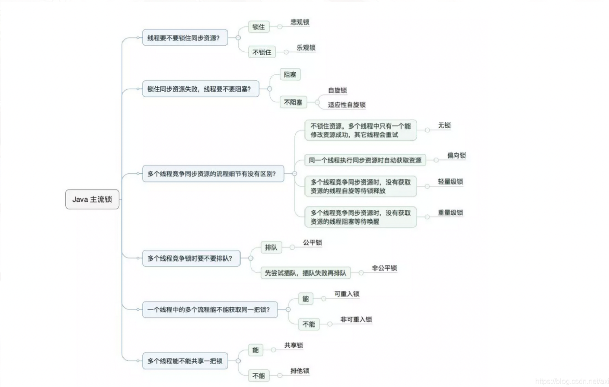
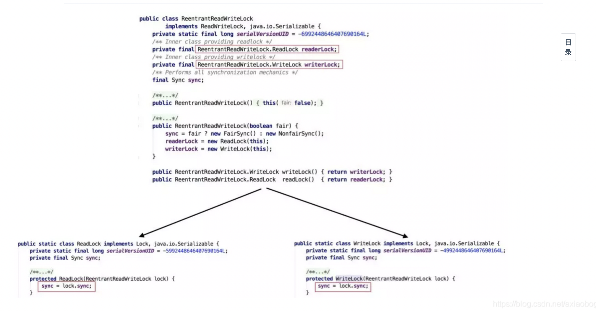
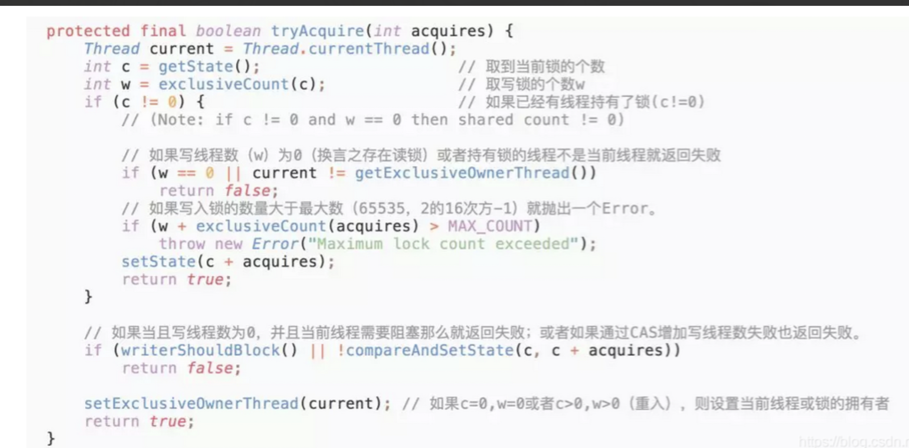
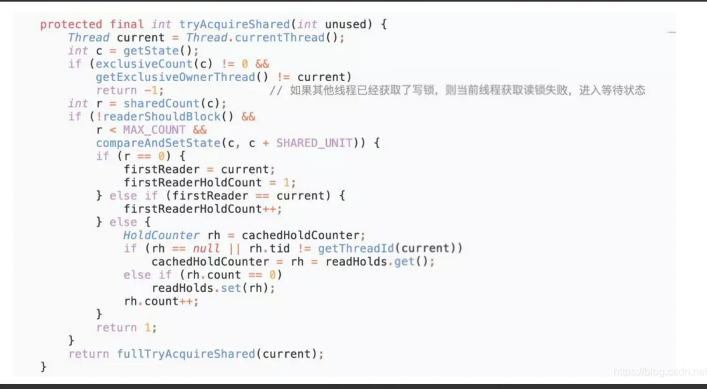
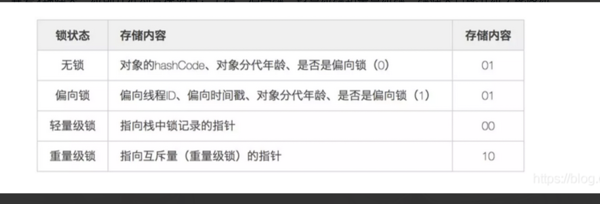
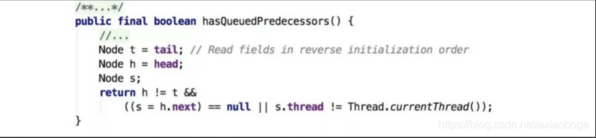
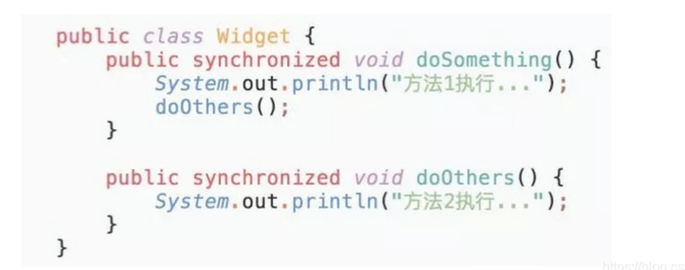

#  java锁全部整理
  
  


  
学习java锁之前呢，需要先把AQS过一遍理解之后才会更容易理解锁的创造
  
从面试角度看： **以下必须弄懂**
1. 共享和排他优先
2. 锁升级
3. sync和lock
4. 重入
5. AQS
  
##  独享锁以及共享锁
  
简单概念：
如果一个线程对资源A加上排他锁，之后所有的线程都不能对该资源加上任何的锁，拥有排他锁的线程对资源拥有修改及读取的权限
如果一个线程对资源A加上共享锁，之后其他的线程对该资源也只能加上共享锁，拥有共享锁的线程只可以对资源进行读取操作
JDK中的synchronized和JUC中Lock的实现类就是互斥锁。
独享锁与共享锁也是通过**AQS**来实现的，通过实现不同的方法，来实现独享或者共享。
**学习使用ReentrantReadWriteLock**

  
读锁是共享锁，写锁是独享锁。读锁的共享锁可保证并发读非常高效，而读写、写读、写写的过程互斥，因为读锁和写锁是分离的。所以ReentrantReadWriteLock的并发性相比一般的互斥锁有了很大提升。
在最开始提及AQS的时候我们也提到了state字段（**int类型，32位**），该字段用来描述有多少线程获持有锁。
在ReentrantReadWriteLock中有读、写两把锁，所以需要在一个整型变量state上分别描述读锁和写锁的数量（或者也可以叫状态）
高16位表示读锁状态（读锁个数），低16位表示写锁状态（写锁个数）

  
写锁的枷锁流程：

1. 有锁，但低16位是0（写锁为0），说明有读锁，则不能获取锁
2. 写入锁数量大于65535，则不能继续获取锁，同一个线程，表示可重入锁不能大于65535
3. 如果当前线程写入锁为0，当前线程需要阻塞（CAS获取锁失败），说明有锁正在获取中，则本线程获取锁失败
4. 支持重入锁的
  
必须确保写锁的操作对读锁可见，如果允许读锁在已被获取的情况下对写锁的获取，那么正在运行的其他读线程就无法感知到当前写线程的操作
  
读锁的流程：

1. 如果其他线程已经获取了写锁，则当前线程获取读锁失败，进入等待状态
2. 如果当前线程获取了写锁或者写锁未被获取，则当前线程（线程安全，**依靠CAS保证**）增加读状态，成功获取读锁
  
##  锁升级
  
锁升级针对：synchronized
###  synchronized 如何实现锁升级的
  
“Java对象头”、“Monitor”
synchronized是悲观锁，在操作同步资源之前需要给同步资源先加锁，这把锁就是存在Java对象头里的
**对象头**主要包括两部分数据：Mark Word（**标记字段**）、Klass Pointer（**类型指针**）。  
  
  
Mark Word（**标记字段**）:默认存储对象的HashCode，分代年龄和锁标志位信息
Klass Point（**类型指针**）：对象指向它的类元数据的指针，虚拟机通过这个指针来确定这个对象是哪个类的实例。
  
 “Monitor”
Monitor可以理解为一个同步工具或一种同步机制，通常被描述为一个对象。
synchronized通过Monitor来实现线程同步，Monitor是依赖于底层的**操作系统的Mutex Lock**（互斥锁）来实现的线程同步。
依赖于Mutex Lock属于重量级锁，需要切换cpu状态来完成  
  
Mark Word内容

  
1. 无锁：
   1. 无锁没有对资源进行锁定，所有的线程都能访问并修改同一个资源，但**同时只有一个线程能修改成功**。
   2. 举例CAS
2. 偏向锁
   1. 偏向锁是指一段**同步代码一直被一个线程所访问**，那么该线程会自动获取锁，降低获取锁的代价。
   2. 当一个线程访问同步代码块并获取锁时，会在Mark Word里**存储锁偏向的线程ID**
   3. 引入偏向锁是为了在无多线程竞争的情况下尽量减少不必要的轻量级锁执行路径，因为**轻量级锁的获取及释放依赖多次CAS原子指令**，而偏向锁**只需要在置换ThreadID的时候依赖一次CAS**原子指令即可。
3. 轻量级锁
   1. 是指当锁是偏向锁的时候，被另外的线程所访问，偏向锁就会升级为轻量级锁，其他线程会通过自旋的形式尝试获取锁，不会阻塞，从而提高性能。
   2. 若当前只有一个等待线程，则该线程通过自旋进行等待。但是当自旋超过一定的次数，或者一个线程在持有锁，一个在自旋，又有第三个来访时，轻量级锁升级为重量级锁
4. 重量级锁
   1. 此时等待锁的线程都会进入阻塞状态
  
总之，虽然 CAS 操作在 synchronized 轻量级锁和无锁技术中都有使用，但两者的概念和应用场景是不同的。**轻量级锁是一种针对 synchronized 关键字在低竞争情况下的优化，而无锁则是一种通常需要在高并发情况下实现的乐观并发控制技术**。
  
##  公平或非公平锁
  
区别在于：公平锁在获取锁的时候会多一个方法，hasqueuedProcessors（）
  
hasqueuedProcessors（）

  
主要是判断当前线程是否位于同步队列中的第一个。如果是则返回true，否则返回false。
  
##  可重入锁
  
可重入锁又名递归锁，是指在**同一个线程在外层方法获取锁的时候，再进入该线程的内层方法会自动获取锁**（前提锁对象得是同一个对象或者class），不会因为之前已经获取过还没释放而阻塞。Java中ReentrantLock和synchronized都是可重入锁，可重入锁的一个优点是可一定程度避免死锁。
  

同一个对象中的两个内置锁，如果是不可重入的锁，出现了dosomthing后再执行doother；需要事先释放对象锁才能执行dother，就会产生死锁
  
可重入锁实现：ReentrantLock
非可重入锁实现：NonReentrantLock
  
一个是每次state + 1，释放每次state -1；
另一个很直接设置为state = 1；释放的时候直接将state 设置为0
  
synchronized 锁：
    1. 可重入
    2.  不可中断 
    3.  非公平
Lock: 
    1. 可重入
    2. 可判断
    3. 可公平（两者皆可）
  
  
1. ReentrantLock 显示的获得、释放锁，synchronized 隐式获得释放锁
2. ReentrantLock 可响应中断、可轮回，synchronized 是不可以响应中断的，为处理锁的
不可用性提供了更高的灵活性
3. ReentrantLock 是 API 级别的，synchronized 是 JVM 级别的
4. ReentrantLock 可以实现公平锁
5. ReentrantLock 通过 Condition 可以绑定多个条件
6. 底层实现不一样， synchronized 是同步阻塞，使用的是悲观并发策略，lock 是同步非阻
塞，采用的是乐观并发策略
7. Lock 是一个接口，而 synchronized 是 Java 中的关键字，synchronized 是内置的语言
实现。
8. synchronized 在发生异常时，会自动释放线程占有的锁，因此不会导致死锁现象发生；
而 Lock 在发生异常时，如果没有主动通过 unLock()去释放锁，则很可能造成死锁现象，
因此使用 Lock 时需要在 finally 块中释放锁。
9. Lock 可以让等待锁的线程响应中断，而 synchronized 却不行，使用 synchronized 时，
等待的线程会一直等待下去，不能够响应中断。
10. 通过 Lock 可以知道有没有成功获取锁，而 synchronized 却无法办到。
11. Lock 可以提高多个线程进行读操作的效率，既就是实现读写锁等。
  
  
  
#  线程间的通讯方式
  
1. volatile
   1. 关键字volatile可以用来修饰字段（成员变量），就是告知程序任何对该变量的访问均需要从共享内存中获取，而对它的改变必须同步刷新回共享内存，它能保证所有线程对变量访问的可见性
2. synchronized(wait notify)
   1. 根据synchronized原理使用Object类提供了线程间通信的方法：wait()、notify()、notifyaAl()方法来实现多个线程互斥访问临界区资源，Object类这几个方法必须配合synchronized来进行使用。
   ```java
   public class TestSync 
    public static void main(String[] args) {
        // 定义一个锁对象
        Object lock = new Object();
        List<String>  list = new ArrayList<>();
        // 实现线程A
        Thread threadA = new Thread(() -> {
            synchronized (lock) {
                for (int i = 1; i <= 10; i++) {
                    list.add("abc");
                    System.out.println("线程A向list中添加一个元素，此时list中的元素个数为：" + list.size());
                    try {
                        Thread.sleep(500);
                    } catch (InterruptedException e) {
                        e.printStackTrace();
                    }
                    if (list.size() == 5)
                        lock.notify();// 唤醒B线程
                }
            }
        });
        // 实现线程B
        Thread threadB = new Thread(() -> {
            while (true) {
                synchronized (lock) {
                    if (list.size() != 5) {
                        try {
                            lock.wait();
                        } catch (InterruptedException e) {
                            e.printStackTrace();
                        }
                    }
                    System.out.println("线程B收到通知，开始执行自己的业务...");
                }
            }
        });
        //　需要先启动线程B
        threadB.start();
        try {
            Thread.sleep(1000);
        } catch (InterruptedException e) {
            e.printStackTrace();
        }
        // 再启动线程A
        threadA.start();
    }
    ```
   **存在的问题**：notify和wait一定要配合synchorized使用
   wait是要释放对象锁，进入等待池；既然是释放对象锁，那么肯定是先要获得锁。所以wait必须要写在synchronized代码块中，否则会报异常。
   **notify()或者notifyAll()调用时并不会真正释放对象锁, 必须等到synchronized方法或者语法块执行完才真正释放锁.**
   notify在源码中的注视是随机唤醒线程，但是具体是依赖与实现，在hotspot的JVM中；但是在hotspot对notofy()的实现并不是我们以为的随机唤醒, 而是“先进先出”的顺序唤醒!
   wait：释放锁并且释放cpu
   sleep: 不会释放锁，但是会释放cpu
3. countdownLunch
   1. countdown() + await()
   ```java
   public class TestSync 
    public static void main(String[] args) {
        CountDownLatch countDownLatch = new CountDownLatch(1);
        List<String>  list = new ArrayList<>();
        // 实现线程A
        Thread threadA = new Thread(() -> {
            for (int i = 1; i <= 10; i++) {
                list.add("abc");
                System.out.println("线程A向list中添加一个元素，此时list中的元素个数为：" + list.size());
                try {
                    Thread.sleep(500);
                } catch (InterruptedException e) {
                    e.printStackTrace();
                }
                if (list.size() == 5)
                    countDownLatch.countDown();
            }
        });
        // 实现线程B
        Thread threadB = new Thread(() -> {
            while (true) {
                if (list.size() != 5) {
                    try {
                        countDownLatch.await();
                    } catch (InterruptedException e) {
                        e.printStackTrace();
                    }
                }
                System.out.println("线程B收到通知，开始执行自己的业务...");
                break;
            }
        });
        //　需要先启动线程B
        threadB.start();
        try {
            Thread.sleep(1000);
        } catch (InterruptedException e) {
            e.printStackTrace();
        }
        // 再启动线程A
        threadA.start();
    }
    ```
  
4. LockSupport
   1. 基于park()和unpark()进行线程的阻塞
   2. 与synchronize的wait和notify的区别
      1. 简单：不需要获取锁，能直接阻塞线程。
      2. 直观：以thread为操作对象更符合阻塞线程的直观定义；
      3. 可以准确地唤醒某一个线程（notify随机唤醒一个线程，notifyAll唤醒所有等待的线程）；
      4. unpark方法可以在park方法前调用。（而wait通常在notify之后进行）
   ```java
   public class TestSync 
    public static void main(String[] args) {
        List<String> list = new ArrayList<>();
        // 实现线程B
        final Thread threadB = new Thread(() -> {
            if (list.size() != 5) {
                LockSupport.park();
            }
            System.out.println("线程B收到通知，开始执行自己的业务...");
        });
        // 实现线程A
        Thread threadA = new Thread(() -> {
            for (int i = 1; i <= 10; i++) {
                list.add("abc");
                System.out.println("线程A向list中添加一个元素，此时list中的元素个数为：" + list.size());
                try {
                    Thread.sleep(500);
                } catch (InterruptedException e) {
                    e.printStackTrace();
                }
                if (list.size() == 5)
                    LockSupport.unpark(threadB);
            }
        });
        threadA.start();
        threadB.start();
    }
    ```
    A输出5个，然后B，然后继续输出A的后5个
5. 信号量（Semaphore）：代码看AQS，还能用做限流服务
6. 管道通信（与队列类似）
  