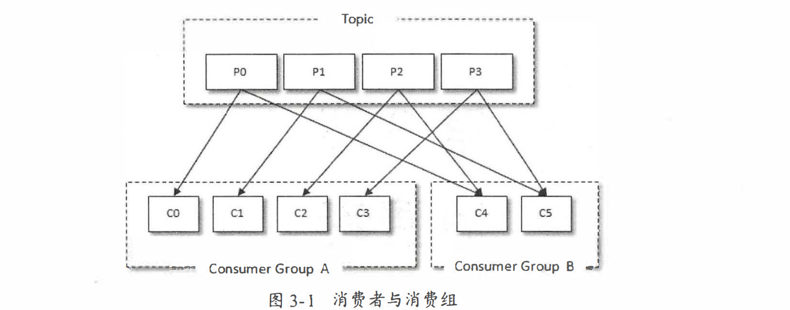

# producer
1. KafkaProducer是线程安全的，可以在多个线程中共享单个KafkaProducer实例
2. 数据发送流程 ->对象 >拦截器 >序列化 >分区器 >broker
   1. 发送的对象ProducerRecord
      1. ```public class ProducerRecord<K, V> { 
        private final String topic; 主题
        private final Interger partion; 分区号
        private final Headers headers; 消息头部
        private final K key; 键
        private final V value; 值
        priva七e final Long timestamp; 消息的时间戳
        } ```  
   2. 消息的构造
      1. public ProducerRecord(String topic, Integer partition, K key, V value)
      2. public ProducerRecord(String topic, V value)
      3. 等。。。
   3. 发送方式
      1. 同步
         1. public Future<RecordMetadata> send(ProducerRecord<K, V> record)
      2. 异步
         1. public Future<RecordMetadata> send(ProducerRecord<K, V> record, Callback callback)
         2. 回调中：{onCompletion(RecordMetadata metadata, Exception exception){}} 实现该方法两个回调参数，两者只有一个会返回，要不就是异常，如果不是异常就正常返回元数据
         3. RecordMetadata ： 无论回调还是listener异步，返回对象RecordMetadata元数据：包含：主题、分区号、分区中的偏移量(offset)、 时间戳
         4. ProducerConfig.RETRIES_CONFIG ： 通过配置该配置改变重试次数
   4. 序列化方式：
      1. 可以自定义序列化方式，实现kafka的Serializer<T>的接口
      2. 在properties中添加相关的序列化类比如 companySer imp Seralizer<Company> 则添加
         1. properties.put(ProducerConfig.KEY_SERIALIZER_CLASS_CONFIG, StringSerializer.class.getName()); 
         2. properties. put(ProducerConfig.VALUE_SERIAL工ZER_CLASS_CONFIG, CompanySerializer.class.getName());
   5. 分区器：
      1. 如果消息ProducerRecord中指定了 partation字段， 那么就不需要分区器的作用， 因为partation字段代表的就是所要发往的分区号
      2. 默认分区器是org.apache.kafka.clients.producer.intemals.DefaultPartationer
         1. 默认分区器通过对key的MurmurHash2算法，如果key为null。默认在可用的分区（partation）中进行轮询
         2. 这里被强调，如果不为null在所有的分区中任意一个，如果为null则在可用分区中找到任意一个
      3. 可以自己实现kafak的的Partitioner（接口），通过其中的int partation() 来实现分区寻找
         1. properties.put(ProducerConfig.PARTITIONER_CLASS_CONFIG ,DemoPartitioner.class.getName());显示配置启动producer
   6. 拦截器：
      1. 实现kafka的Producerlnterceptor的接口，可以实现方法onSend(), onAcknowledgement(),close()
      2. onsend:可以实现将每个消息头都加个特殊字段
      3. onAcknowledgement 在发送中callBack的之前处理
      4. ProducerinterceptorPrefix impl Producerlnterceptor
         1. 启动producer中可以 properties.put(ProducerConf.INTERCEPTOR_CLASSES_CONFIG ,ProducerinterceptorPrefix.class.getName());
   7. 发送的整体框架
      1. 
      2. 两个主要线程主线程/sender线程
         1. 主线程：主要使用了消息累加器，消息累加器，默认32M
            1. 为每个partation都维护了一个队列
         2. sender线程
            1. 做了一个抓换，将主线程中的partation - msg =〉 node(broker节点) - msg
            2. 对数据进行缓存（InFlightRequests中）：缓存了已经发出去但还没有收到响应的请求
            3. InFlightRequests 还可以获得 leastLoadedNode。通过leastLoadedNode 节点可以判断出那个node的负载最小
            4. 元数据的更新 元数据：集群中有哪些主题，这些主题有哪些分区，每个分区的lead副本分配在哪个节点上，follower副本分配在哪些节点上

# consumer
1.  
2. 
3. 消费者流程
   1. 配置参数 -> 订阅主题 -> 拉去消息并消费 -> 提交位移 -> 关闭消费者

1. 主题与分区
   1. 写多个subscribe方法会被覆盖
   2. 不仅可以订阅主题，也可以订阅分区 
      1. public void subscribe(Pat七ern pattern, ConsumerRebalanceListener listener)
   3. 支持用正则订阅consumer.subscribe(Pattern.compile("topic-.*"));
   4. 还可以直接订阅某些主题的特定分区，在KafkaConsumer中还提供了 一个 assign()方法来实现这些功能
      1. public void assign(Collection<TopicPartition> partitions)
      2. TopicPartition ： partition; / topic;
      3. public List<Partitioninfo> par七itionsFor(String topic)  可以找到topic有多少个分区
         1. public class Partitioninfo { 
                           private final String 七opic;
                           private final int parti七ion;
                           private final Node leader; 
                           private final Node[] replicas; 
                           private final Node[] inSyncReplicas; 
                           private final Node[] offlineReplicas; 
            }partition代表分区编号，leader代表分区的leader副本所在的位置，replicas代表分区的AR集合，inSyncReplicas代表分区的ISR集合，offlineReplicas代表分区的OSR集合。
2. 消费者与生产者对应同样支持定义反序列化，实现kafka的接口Deserializer
3. 消息消费
   1. Kafka中的消息消费是一个不断轮询的过程，消费者所要做的就是重复地调用poll()方法
   2. public ConsumerRecords<K, V> poll(final Duration timeout)
   3. 如果应用线程唯一 的工作就是从 Kafka中拉取并消费消息，则可以将这个参数设置为最大值Long.MAX_VALUE
   4. poll()方法的返回值 类型是ConsumerRecords, 它用来表示一次拉取操作所获得的消息集，可以类比producer的ProducerRecord消息
4. 位移提交
   1. offset概念
      1. 对于kafka
         1. 消息在分区中的位置 ： 偏移量
      2. 对于consumer
         1. 消费者消费的位置 ： 位移
         2. 消费位移存储在 Kafka 部的主题 consumer_offsets 这里把将消费位移存储起来（持久化）的动作称为“提交’ ，消费者在消费完消息之后需要执行消费位移的提交。
         3. 如果一次消费的数量是x，那么x则为我消费的当前位置，而x+1是我要提交的偏移量，称之为position
   2. kafka的位移的默认提交策略
      1. 默认策略：5senconds提交一次。拉取到每个分区中最大的消息位移进行提交
         1. 产生的问题重复消费
            1. 一次的消费，处理一半，然后异常，位移没提交，然后就会产生重复消费
      2. 消息丢失
         1. 消费了x+6提交偏移量，处理线程只处理了x+3，然后冲x+7开始重新拉取，导致了x+3 - x+6数据丢失
         2. 
      3. 手动提交
            1. 同步：commitsync：以每次poll下的数据，的最后一条作为position提交
            2. 异步：commitAsync：public void commitAsync{OffsetCommitCallback callback}
   3. 支持暂停某些分区
      1. 暂停：public void pause(Collect on<TopicPartition> partitions)
      2. 恢复：public roid resume(Collection<TopicPartition> partitions)
   4. 支持指定位移消费
      1. 客户端参数auto.offset.reset
         1. latest : 最后
         2. earliest ： 从position是0开始
         3. none：必须有消费位移，如果没有消费位移就报错
         4. seek（）：可以让我们追赶消息或者回溯消息。方法定义：public void seek(TopicPartiton parttion long offset)
            1. consumer.seek(tp , 10); 表明从这个partation的偏移量10开始消费
            2. seek()方法只能重置消费者分配到的分区的消费位置;而分区的分配是在 poll()法的调用过程中实现的
            3. **也就是说，在执行 seek（）方法之前需要先执行一次 poll （） 方法 等到分配到分区之后才可以重置消费位置**有意思
            4. ```{consumer poll(Duratio ofMillis(lOOOO))；① 
                     Set<TopicPartition> assignment = consumer.assignment （） ② 
                        for (Top cPartition tp : assignment) { 
                              consumer . seek(tp , 10) ; }}```
                              必须consumer分配到了分区，才能修改从分区拉取数据的位置
   5. 再均衡
      1. subscribe(Collection<String> topics, ConsumerRebalanceListener listener)
      2. ConsumerRebalanceListener ： 回调两个方法：onPartitionsRevoked（发生均衡之前处理的动作）；onPartitionsAssigned（发生均衡之后处理的动作）
   6. 消费拦截器，同producer的incepter
   7. 线程安全问题：
      1. KatkaProducer是线程安全的， 然而KafkaConsumer却是非线程安全的
      2. consumer中的每个公用方法在执行所要执行的动作之前都会调用这个acquire()方法，只有wakeup()方法是个例外
         1. 通过wakeup可以做到判断kafka是否还在运行
            1. while (isRunning. get()) {}
         2. 每个consumer创建一个线程 -> 创建线程池来处理
   8. 一些参数
      1. fetch .min .bytes ： 一次拉取最小数量默认1B
      2. fetch .max.bytes ：一次拉取最大数量 默认50M
      3. fetch.max.wait.ms ：最大等待时间
      4. request.timeout.ms： comsumer最大等待时间
      5. retry.backoff.ms : 退避时间（调用失败重复调用的时间）


