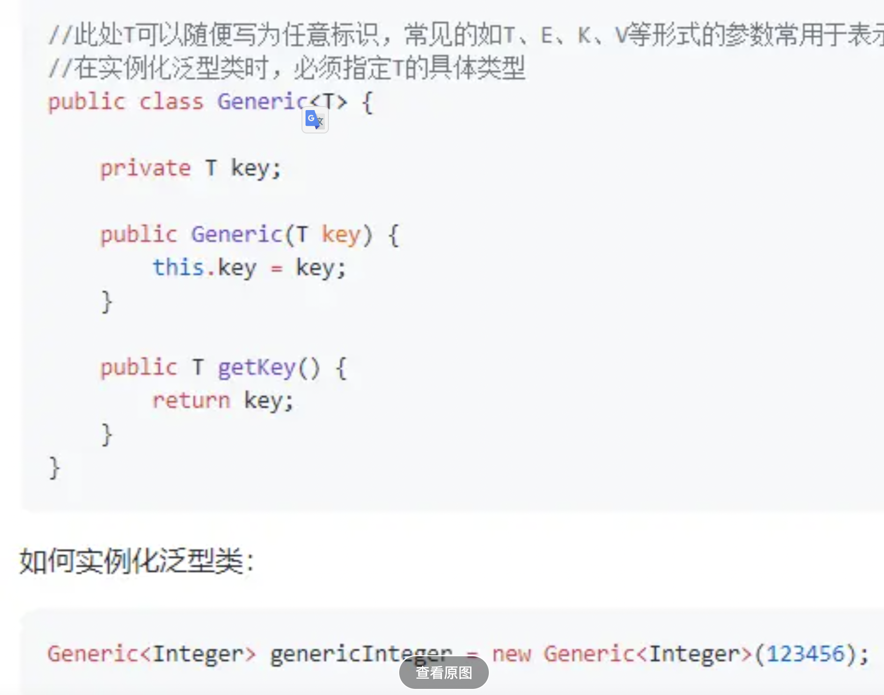
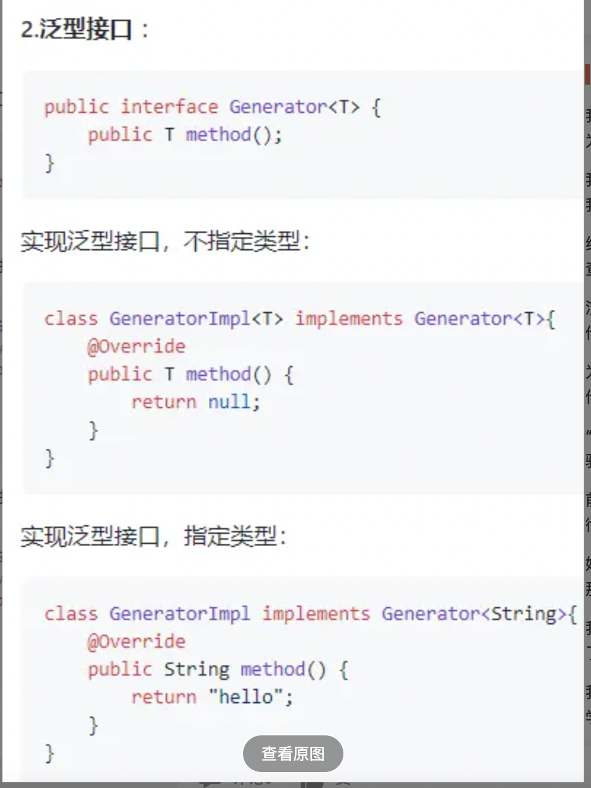
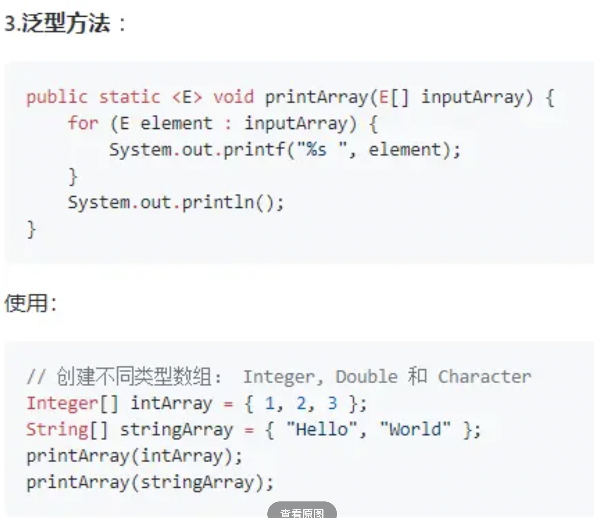
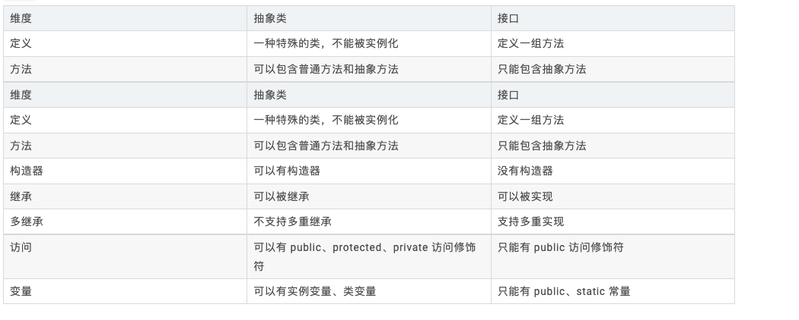

# 基础
## 范型
泛型的本质是**参数化类型**，也就是说所操作的数据类型被指定为一个参数。
Java 的泛型是**伪泛型**，这是因为 Java 在**编译期间，所有的泛型信息都会被擦掉**，这也就是通常所说类型擦除
泛型一般有三种使用方式:泛型类、泛型接口、泛型方法。
1. 范型类

2. 范型接口
   

3. 范型方法
   

## 启动进程
ProcessBuilder.start() 和 Runtime.exec() 
但是每个java程序都是有自己的jvm实例，java程序和jvm实例组成java进程，所以新起的java进程会启动一个新的jvm实例子

OOM并不会导致进程挂了，只会导致线程挂掉，当出现oom线程时候说明内存空间不足，当所有非守护线程都无法正常运行时，此时JVM实例挂了，进程才会停止 -- JVM退出（不存在除守护线程外的其他线程） --->  java进程退出

### oom排查
1. 下载dump
2. jprofile打开
3. 找到占用大内存的class
4. 找到对应的refrence
5. 找到对应的java代码引用对象基本可以进行分析

### 接口和抽象类
什么时候用接口什么时候用抽象类
1. 当需要为一些类提供公共的实现代码时，应优先考虑**抽象类**
2. 当注重代码的扩展性跟可维护性时，应当优先采用接口。
3. 我举个例子：
   1. 汽车抽象类，造轱辘，车框架（**抽象类**）
   2. byd/BMW/。。。各自实现抽象类，去自我实现具体的造车逻辑
   3. 有一个厂商要求汽车有翅膀，提供一个实现翅膀的（**接口**）
   4. 有需要加翅膀的厂商可以实现该接口去拓展自己的功能

1. 接口中的成员变量在实现类中可以直接访问（不管是静态方法还是非静态方法），如果父接口中有重复出现的成员变量，则只能带上接口名加以区分。
2. 接口中default修饰的方法，为子类提供默认实现
3. 子类实现多个接口，多个接口中有同样签名的方法时，根据排序规则，以写在前面的接口为准。如果父接口中的default方法有重复，则子类必须重写此方法（不然，多个接口中分别提供了各自的实现，子类会不知道调用哪一个）。

jvm退出
1. oomkiller：操作系统linux内核的机制，占用过大的内存空间就杀掉
2. jvm自身奔溃，在工作目录下。或者定义的目录下找到hs_err_pid.log
3. jvm没有守护线程，自身所有线程都挂掉