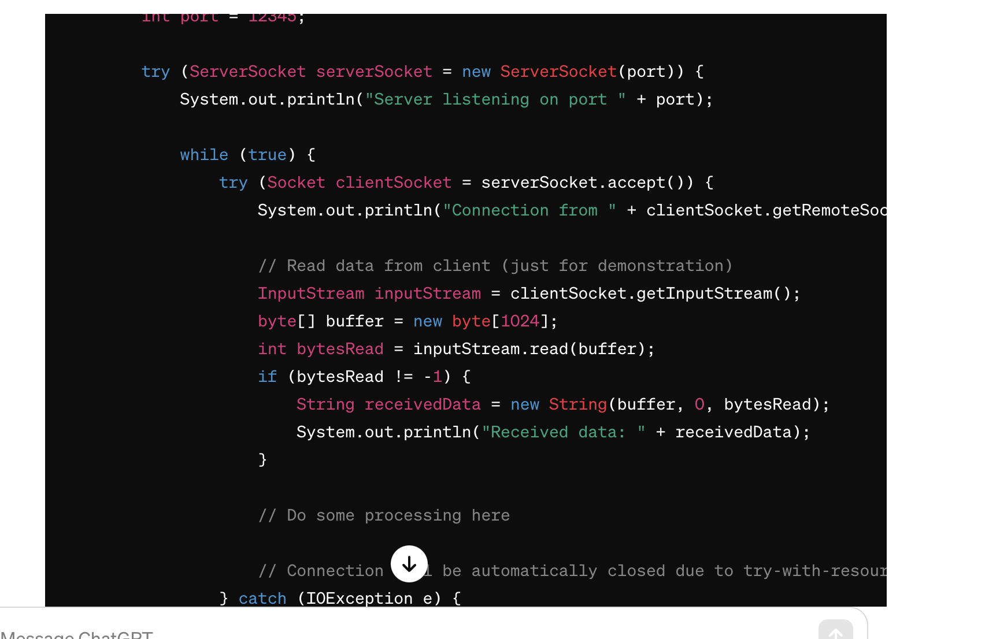

# 网络

## 三次握手

A客户端 -> B服务端
A ---- seq(x),SYN ------ > B
B ---- seq(y),ack(x+1),ACk ---- >A
A ---- ack(y+1),seq(x+1),ACK --- > B

重点：closewait处于客户端发送关闭请求，服务端已反馈该反应，然后服务端还未对客户端发送关闭请求时候产生的
当linux连接中出现大量的close wait会占有连接导致后续请求请求不到，如何解决closewait呢
产生的原因：
    1. 客户端一直在向服务端发送Fin请求，导致，服务端一直处于closewait状态
    2. 服务端一直未关闭，未向客户端发送fin请求  

1. 检查代码问题是否是业务层没有关闭socket连接，该用try resource方式写代码
2. 客户端timeout时间太短，导致服务端还在处理后续业务没有发送fin的时候客户端timeout超市，导致服务端一直存在closewait
3. 

## 一个http请求经历过哪些流程

1. DNS服务器，解析域名（baidu.com ） -〉 1.1.1.1
2. 进行tcp的三次握手
3. 发送http请求，如果请求中包含动态语言，服务器使用动态语言解释器进行解释
4. （springMvc流程），dispatcher -> handlerMapping -> handlerAdapter -> handler -> modelAndView
5. 返回客户端

## TCP保证传输的可靠性

1. 基于数据块传输
2. 基于数据块的编号，保证顺序及重传
3. 校验数据块，对数据块大小教研
4. 客户端超时重传，定时器监控发送的消息是否有响应，若没有则重传
5. **流量控制**：滑动窗口
6. **拥塞控制**：网络阻塞时候的处理方案，减少网络数据包传输

### 流量控制

用滑动窗口实现流量控制。流量控制是为了**控制发送方发送速率**，保证接收方来得及接收
如果接受方告诉发送方他的窗口为0，则发送方发不出来
产生流程控制的根本原因：接收方和发送方速率不想等，可能出现处理不过来从而丢弃数据，这样白白占用网络资源所以需要流量控制进行接受方和发送方的动态平衡

**Tcp是全双工通信**

发送窗口

接收窗口

**接收窗口的大小是根据接收端处理数据的速度动态调整的**。 如果接收端读取数据快，接收窗口可能会扩大

## 拥塞控制

拥塞控制就是为了防止过多的数据注入到网络中，这样就可以使网络中的路由器或链路不致过载
他与流量控制区别在于，拥塞控制是全局包含所有的路由器，主要在意的是全局的网络负载
而流量控制看重的端对端点对点的流量控制

1. 为了进行拥塞控制，TCP **发送方**要维持一个 拥塞窗口(cwnd) 的状态变量。
2. 拥塞控制窗口的大小取决于网络的拥塞程度，并且动态变化
3. TCP 的拥塞控制采用了四种算法，即 慢开始 、 拥塞避免 、快重传 和 快恢复
4. 慢开始： 慢开始算法的思路是当主机开始发送数据时，如果立即把大量数据字节注入到网络，每经过一个传播轮次，cwnd 加倍。
5. 拥塞避免： 拥塞避免算法的思路是让拥塞窗口 cwnd 缓慢增大，即每经过一个往返时间 RTT 就把发送方的 cwnd 加 1.
6. 快重传与快恢复： 在 TCP/IP 中，**快速重传和恢复（fast retransmit and recovery，FRR）**是一种拥塞控制算法，它能快速恢复丢失的数据包

## ARQ 协议

**自动重传请求**（Automatic Repeat-reQuest，ARQ）是 OSI 模型中数据链路层和传输层的错误纠正协议之一

### 停止等待 ARQ 协议

它的基本原理就是**每发完*一个分组*就停止发送，等待对方确认（回复 ACK）**。如果过了一段时间（超时时间后），还是没有收到 ACK 确认，说明没有发送成功，需要重新发送，直到收到确认后再发下一个分组；

### 连续 ARQ 协议

1. 发送方维持一个发送窗口，凡位于发送窗口内的分组可以连续发送出去，而不需要等待对方确认
2. 接收方一般采用累计确认，对按序到达的最后一个分组发送确认，表明到这个分组为止的所有分组都已经正确收到了。

## http的非对称加密

  
怎么理解呢：就是服务端的公钥如何给到客户端，直接给可能截胡，就需要CA中间加密一下，生成的CA证书，再通过服务端给客户端，然后客户端通过CA给的公钥把服务端的公钥揭秘出来，然后通过公钥就可以传输了

## 传输为什么用rpc、retsful不行么

1. 传输协议上：长连接 序列化protubuffer都是支持的
2. 效率上 tcp 优于http
3. rpc面向服务的高级封装：服务发现/重试/熔断；http不具备